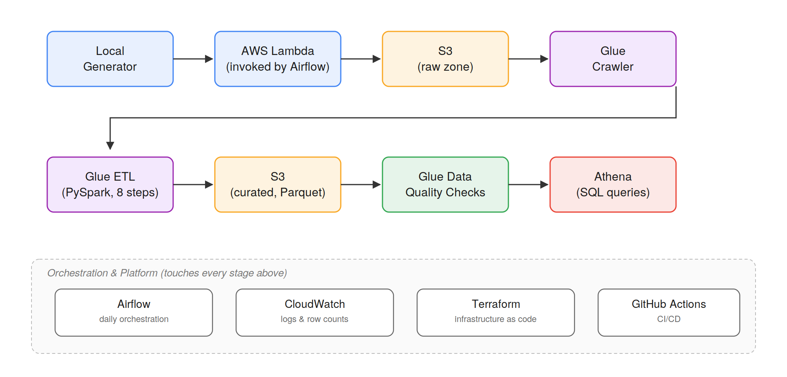

# Real-Time E-Commerce Analytics Pipeline

*From raw clickstream to business insight — a production-grade AWS data platform*

[](https://github.com/loukmane-lok/ecommerce-data-platform/actions/workflows/ci.yml)

An end-to-end analytics platform that ingests e-commerce order events via AWS Lambda, transforms them with a PySpark ETL pipeline on AWS Glue, and serves business metrics through Athena — orchestrated daily by Apache Airflow and provisioned entirely with Terraform.

## Architecture



Order and clickstream events are generated locally and sent to an AWS Lambda function, which writes each event as JSON to a Hive-partitioned raw zone in S3. In the orchestrated daily pipeline, Airflow triggers the local generator as a subprocess and invokes Lambda directly through the AWS SDK (`boto3`), rather than over HTTP; the Lambda function also exposes an IAM-protected Function URL for signed HTTP calls if needed, while `make ingest` uses the AWS CLI invoke API for ad-hoc testing. A Glue Crawler catalogs the raw data, after which a PySpark ETL job on AWS Glue applies a six-step transformation pipeline and writes the result as partitioned Parquet to a curated S3 zone. A Glue Data Quality job then validates the curated data against four checks before it becomes queryable through Athena. Apache Airflow, running in Docker with a LocalExecutor, orchestrates this entire sequence on a daily schedule, while CloudWatch captures logs and row counts at every stage.

## Tech Stack

| Tool | Purpose | Why this tool |
|---|---|---|
| Python | Event generation, Lambda handler, transformation logic | Single language across ingestion and transformation keeps the codebase approachable and testable with a shared toolchain |
| AWS Lambda | Serverless event ingestion (SDK/CLI invoke; optional IAM Function URL) | No server to provision for a bursty, low-latency ingestion path; scales to zero between events |
| S3 | Raw and curated data storage | Durable, cheap object storage that both Glue and Athena can query directly without a separate database layer |
| AWS Glue (Crawler) | Schema inference and Data Catalog population | Removes the need to hand-maintain table DDL as the raw schema evolves |
| AWS Glue (ETL) | Serverless PySpark transformation execution | Avoids managing EMR cluster lifecycle/scaling for a workload that only runs briefly once a day, at a scale where per-second billing outweighs cluster warm-up overhead |
| PySpark | Distributed transformation logic within Glue | Handles schema validation, deduplication, and derived columns at a scale that would strain single-node pandas |
| Apache Airflow | Daily orchestration of the full pipeline | Explicit DAG dependencies make step ordering and retries visible, versus a chain of ad-hoc cron jobs |
| Docker | Local Airflow runtime | Reproducible orchestration environment without requiring a managed Airflow service for a portfolio-scale project |
| AWS Athena | Serverless SQL querying of curated Parquet | No cluster to manage for ad-hoc business queries; pay only per byte scanned |
| CloudWatch | Centralized logs and row-count metrics | Single place to trace a failure back to the exact ETL step and row count where it occurred |
| Amazon SNS | Billing alert notifications | Early warning if AWS spend deviates from the expected near-zero baseline, without manually checking the console |
| Terraform | Infrastructure as code for all AWS resources | Infrastructure changes are reviewable, versioned, and reproducible rather than made by hand in the console |
| GitHub Actions | CI (lint/test) and CD (script deploy) | Runs automatically on every PR and merge without a separate CI service to configure |

## Quick Start

**Prerequisites:** Python 3.10+, AWS CLI configured, Docker Desktop.

```bash
git clone https://github.com/loukmane-lok/ecommerce-data-platform.git
pip install -r requirements.txt
make test
```

## Data Model

### Orders (curated)

| Column | Type | Description | Nullable |
|---|---|---|---|
| order_id | string | Unique order identifier | No |
| user_id | string | Unique user identifier | No |
| product_id | string | Product identifier (e.g. `PROD-0042`) | No |
| price | double | Unit price at time of order | No |
| quantity | int | Units ordered | No |
| timestamp | string | Order timestamp, ISO 8601 UTC | No |
| status | string | `pending` \| `confirmed` \| `shipped` \| `cancelled` | No |
| country | string | ISO country code | No |
| order_value | double | Derived: `price * quantity` | No |
| order_date | date | Derived from timestamp; partition key | No |
| category | string | Product category; partition key | No |

The curated table is partitioned by `order_date` and `category` so that date-range and category-scoped business queries prune irrelevant S3 folders before scanning, rather than reading the entire dataset.

### Clicks (raw)

| Column | Type | Description | Nullable |
|---|---|---|---|
| session_id | string | Browser session identifier | No |
| user_id | string | User identifier | Yes — anonymous visitors |
| page_type | string | `home` \| `product` \| `cart` \| `checkout` \| `confirm` | No |
| product_id | string | Product identifier; only meaningful on product pages | Yes |
| timestamp | string | Click timestamp, ISO 8601 UTC | No |
| device | string | `mobile` \| `desktop` \| `tablet` | No |
| country | string | ISO country code | No |
| referrer | string | `google` \| `direct` \| `email` \| `social` | Yes |

Click events land in the raw S3 zone in the same Hive-partitioned JSONL format as orders, but are not currently crawled into the Glue Data Catalog, so they are not yet queryable via Athena.

## Pipeline

### Ingestion

A local Python generator produces synthetic order and clickstream events, injecting realistic noise such as null fields and out-of-range values. In the orchestrated daily pipeline, Airflow runs the generator as a subprocess and passes its output directly to an AWS Lambda function through the AWS SDK (`boto3`'s `invoke`), which writes each event as a line of JSON to a Hive-partitioned raw zone in S3. For ad-hoc runs outside the DAG, use `make ingest` (AWS CLI `lambda invoke` with your IAM user) or the optional Function URL with SigV4 signing (`lambda:InvokeFunctionUrl`).

### Processing

A Glue Crawler catalogs the raw zone, after which a PySpark ETL job transforms it through six sequential steps: schema validation, type casting, null handling, range filtering, deduplication, and derived-column generation. Row counts are logged after every step so a data volume drop can be traced back to the exact stage that caused it. Deduplication uses a window function keyed on `order_id`, keeping the earliest timestamp per order — a deterministic rule rather than an arbitrary "keep whichever row arrives first."

### Orchestration

Apache Airflow, running locally in Docker with a LocalExecutor, triggers the full pipeline on a daily schedule and manages step dependencies and retries explicitly through a DAG. LocalExecutor runs tasks as parallel processes on a single machine, which is sufficient at portfolio scale; a production deployment would instead use Amazon MWAA (Managed Workflows for Apache Airflow) to remove the operational burden of maintaining the Airflow infrastructure itself.

### Serving

Once curated data passes Glue Data Quality checks, it becomes queryable through Amazon Athena, which runs SQL directly against partitioned Parquet in S3 with no cluster to provision or manage. Partitioning by `order_date` and `category` allows most business queries to scan only the relevant subset of data rather than the entire table.

## Data Quality

| Check | Validates | Threshold | On Failure |
|---|---|---|---|
| Completeness | `order_id` non-null rate | 100% | Logged to CloudWatch; job does not halt |
| Completeness | `country` non-null rate | 95% | Logged to CloudWatch; job does not halt |
| Uniqueness | `order_id` duplicate count | 0 duplicates | Logged to CloudWatch; job does not halt |
| Freshness | `timestamp` max age | ≤ 24 hours | Logged to CloudWatch; job does not halt |
| Range | `price` bounds | 0.01–10000.0 | Logged to CloudWatch; job does not halt |
| Range | `quantity` bounds | 1–10 | Logged to CloudWatch; job does not halt |

These checks run after the ETL job, against curated Parquet data, and their pass/fail results are written to CloudWatch as structured JSON log entries; the job currently commits regardless of check outcomes, so failures are visible for monitoring but do not yet block downstream consumption.

## Cost

*This project runs at near-zero cost on the AWS free tier.*

| Service | Usage | Monthly Cost (Jun–Jul 2026 actuals) |
|---|---|---|
| AWS Glue | Crawler + ETL + Data Quality job runs | $0.63 – $0.68 |
| S3 | Storage + requests | $0.00 |
| Lambda | Ingestion invocations | $0.00 (within free tier) |
| Athena | Query bytes scanned | $0.00 (within free tier at this scale) |
| CloudWatch | Log ingestion and storage | $0.00 |
| Amazon SNS | Billing alert notifications | $0.00 |
| Airflow | Runs locally in Docker — no AWS charge | $0.00 |

**Total actual monthly cost at portfolio scale: < $2.00.** AWS Glue is the dominant cost driver by a wide margin — every other service in this pipeline runs at or near $0.00 at this data volume. An SNS-based billing alert is configured to flag any deviation from this baseline automatically.

At production data volumes, Glue would remain the primary lever: job-hours scale with both data size and run frequency (e.g. hourly instead of daily), and Athena costs would begin scaling meaningfully with bytes scanned as the curated dataset grows, making partition and file-size optimization increasingly important rather than optional.

## What I Would Add in Production

- **Remote Terraform state (S3 backend + DynamoDB lock).** Local state files can't be safely shared across a team and offer no protection against two people applying changes simultaneously.
- **Apache Iceberg table format.** Adds ACID transactions and time-travel queries on top of S3, so a bad ETL run can be rolled back without manually re-deriving the correct curated data.
- **Data contracts at ingestion.** Enforcing schema before data lands in S3 catches malformed events at the source, rather than discovering the problem several stages later during ETL.
- **Column-level lineage (OpenLineage / Marquez).** Makes it possible to trace exactly which upstream column produced a given business metric, which matters when a number looks wrong and multiple pipeline stages could be the cause.
- **MWAA or Astronomer.** Removes the operational burden of running and scaling Airflow's own infrastructure, which the current LocalExecutor setup pushes onto a single machine.
- **dbt for curated-layer transformations.** Brings version-controlled, testable SQL transformations with automatic dependency graphs, rather than transformation logic living only inside imperative PySpark scripts.
- **Great Expectations for declarative data quality.** The current Glue Data Quality job logs pass/fail results to CloudWatch but does not halt the pipeline on failure; Great Expectations would let quality checks actually block bad data from reaching the curated zone.
- **Redshift Spectrum for TB-scale ad-hoc analytics.** Athena is well-suited to today's data volume, but would need a more powerful query engine once historical data grows into the terabyte range with frequent complex joins.

## Author

**Loukmane Daoudi**
[LinkedIn](https://www.linkedin.com/in/loukmane-daoudi/) · [GitHub](https://github.com/loukmane-lok/)

AI and Data Science Engineering graduate from ENSIA (Algeria), focused on building reliable, production-minded data platforms with Python, AWS, Terraform, Airflow, and PySpark. I enjoy turning raw data into trusted, queryable insights through thoughtful architecture, automation, testing, and monitoring. Currently seeking a data engineering internship (stage) or apprenticeship (alternance) in France, where I can contribute quickly and grow alongside an experienced team.